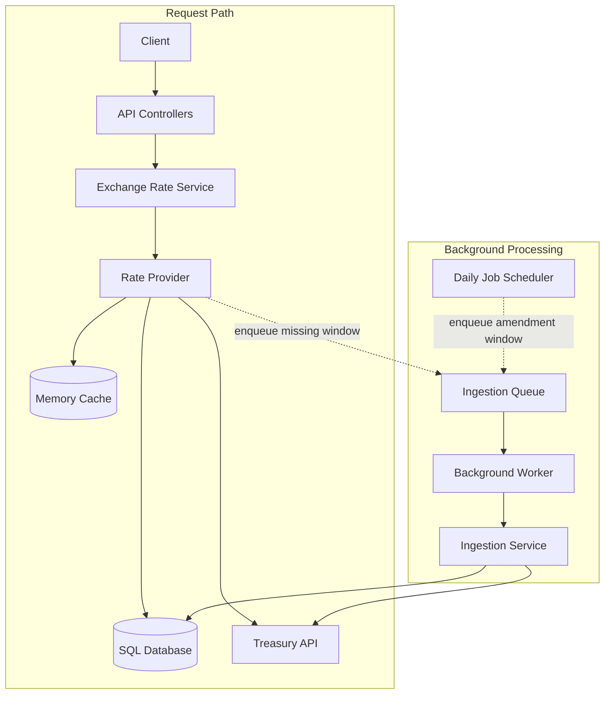
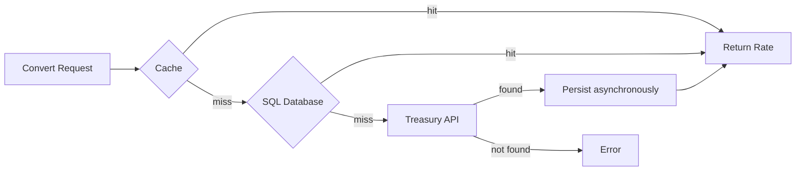

# System Overview

## Architecture

The system is split into:

- Request path (API-driven execution flow)
- Background processing path (asynchronous system maintenance)

## Exchange Rate Resolution

When converting a transaction, the system resolves exchange rates using a strict tiered strategy:

### Lookup order

1. In-memory cache
2. SQL database
3. Treasury API

### Resolution Rules

- Select the most recent valid rate where:
  - `effectiveDate <= transactionDate`
  - within a 6-month lookback window
- If no valid rate exists, return `EXCHANGE_RATE_NOT_FOUND`

## Background Ingestion

The system maintains local exchange rate data to reduce dependency on the Treasury API at runtime. Ingestion is triggered when a Treasury API fallback successfully resolves a missing rate during rate resolution, indicating that the requested data is not present in local storage.

Additional triggers:

- Initial database bootstrap
- Scheduled refresh of historical rate windows

The process:

- Fetches Treasury data for all currencies within the requested date range
- Normalizes and persists exchange rates in SQL
- Invalidates affected cache entries
- Executes asynchronously, independent of request processing

## Key System Properties

- Correctness first — historical rates are deterministically derived from stored and external data
- Hot-path efficiency — most requests are served from cache or database
- Resilience — Treasury API is only used as a fallback source
- Scalability by design — background ingestion decouples heavy data loading from the request path